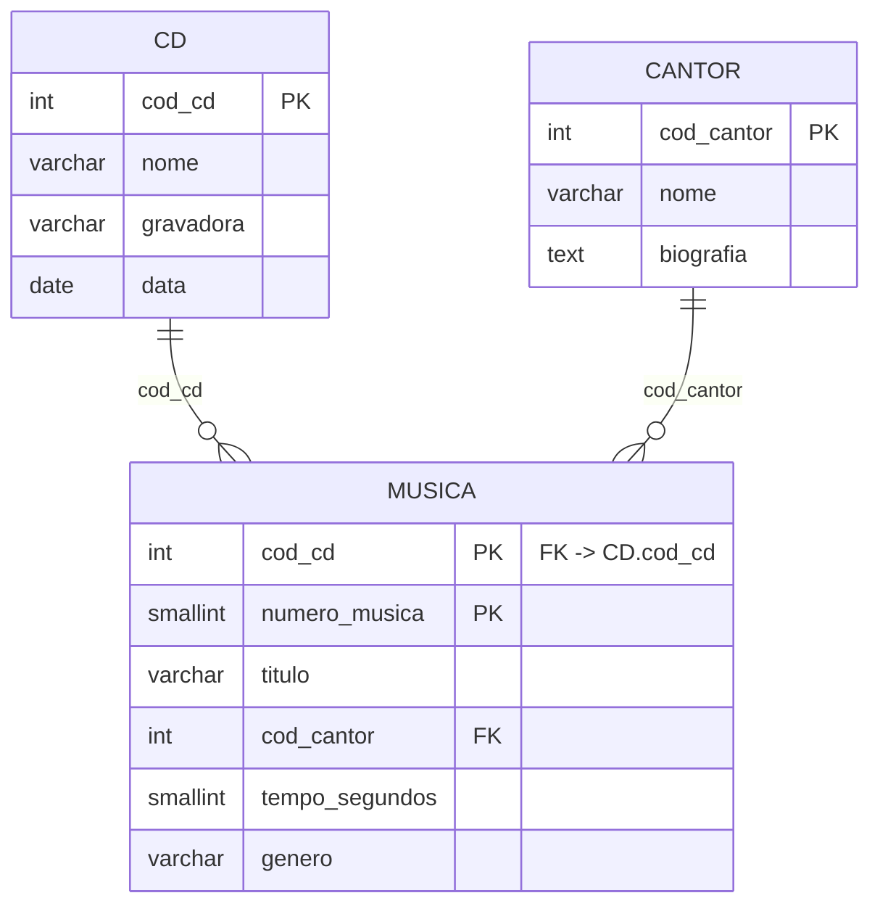

# DER — Diagrama Entidade-Relacionamento

Exporte também uma imagem para `docs/diagramas/der.png`.

## Chaves primárias
- `cd.cod_cd`
- `cantor.cod_cantor`
- `musica.(cod_cd, numero_musica)` — **chave composta**, pois `numero_musica` se
  repete entre CDs diferentes.

## Chaves estrangeiras
- `musica.cod_cd` → `cd.cod_cd`
- `musica.cod_cantor` → `cantor.cod_cantor`

## Constraints relevantes
- `musica.tempo_segundos` — CHECK (> 0)
- `musica.cod_cd`, `musica.cod_cantor` — NOT NULL
- FKs com `ON UPDATE CASCADE ON DELETE RESTRICT` (não é possível apagar um CD ou
  cantor que ainda tenha músicas vinculadas)
