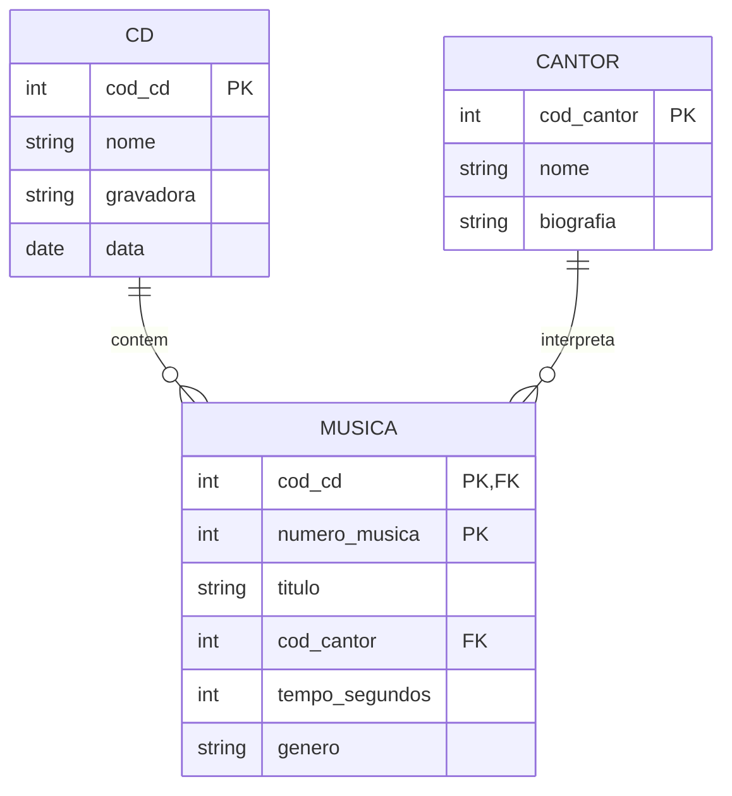

# MER — Modelo Entidade-Relacionamento

Diagrama em Mermaid (renderize em https://mermaid.live, no VS Code ou no GitHub) e
exporte também uma imagem para `docs/diagramas/mer.png`.

## Entidades
- CD
- CANTOR
- MÚSICA (entidade fraca, existe apenas associada a um CD)

## Relacionamentos
- CD → MÚSICA: "contém" (1:N)
- CANTOR → MÚSICA: "interpreta" (1:N)

## Cardinalidades
- CD (1) : (N) MÚSICA — um CD tem várias faixas; uma faixa pertence a um único CD.
- CANTOR (1) : (N) MÚSICA — um cantor interpreta várias músicas; cada música tem um
  único cantor/intérprete principal.
