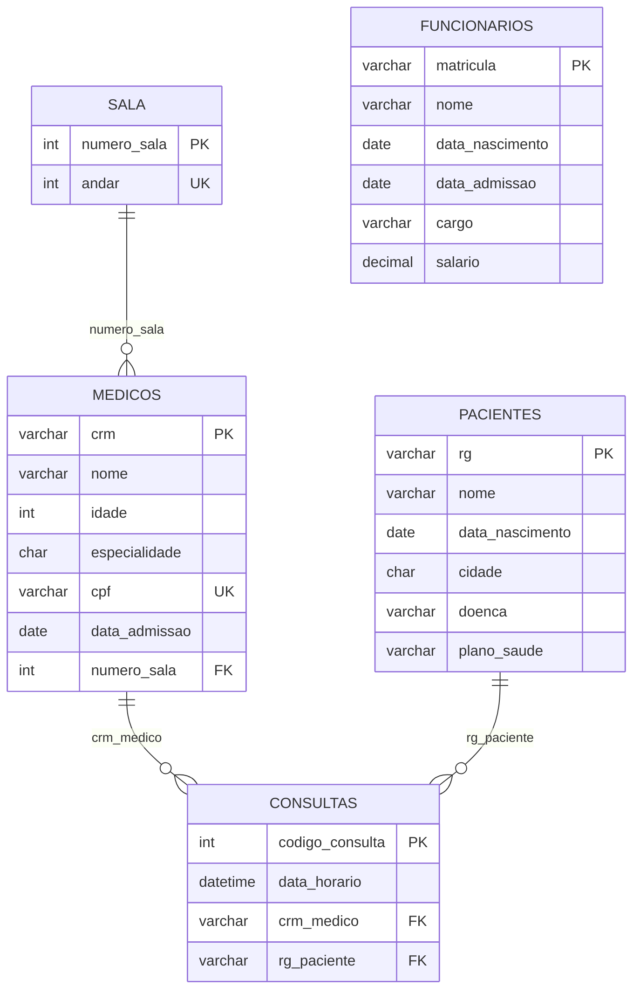

# DER — Diagrama Entidade-Relacionamento

## Chaves primárias
- `sala.numero_sala`
- `medicos.crm`
- `pacientes.rg`
- `funcionarios.matricula`
- `consultas.codigo_consulta`

## Chaves estrangeiras
- `medicos.numero_sala` → `sala.numero_sala`
- `consultas.crm_medico` → `medicos.crm`
- `consultas.rg_paciente` → `pacientes.rg`

## Constraints relevantes
- `sala.numero_sala` — CHECK (> 1 AND < 50)
- `sala.andar` — UNIQUE, CHECK (< 12)
- `medicos.cpf` — UNIQUE
- `medicos.idade` — CHECK (> 23)
- `medicos.especialidade` — DEFAULT 'Ortopedia'
- `pacientes.cidade` — DEFAULT 'Itabuna'
- `pacientes.plano_saude` — DEFAULT 'SUS'
- `funcionarios.cargo` — DEFAULT 'Assistente Médico'
- `funcionarios.salario` — DEFAULT 510.00
- FKs com `ON UPDATE CASCADE ON DELETE RESTRICT`
