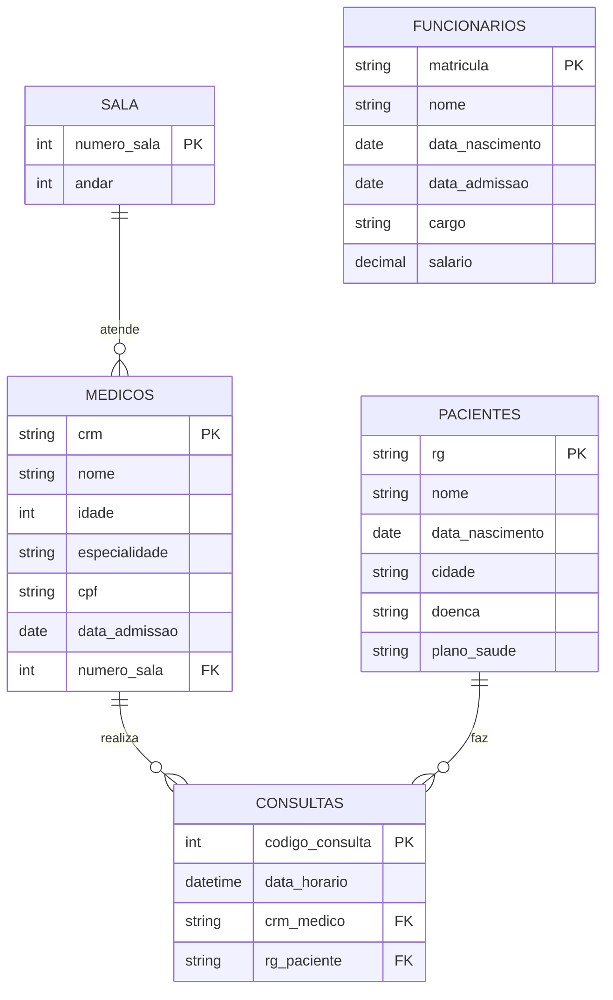

# MER — Modelo Entidade-Relacionamento

> `FUNCIONARIOS` é mantida sem relacionamento, pois o material-base não define
> nenhum vínculo para essa entidade (ver `docs/requisitos.md`).

## Entidades
- SALA, MEDICOS, PACIENTES, FUNCIONARIOS, CONSULTAS

## Relacionamentos
- SALA → MEDICOS: "atende" (1:N — uma sala pode ter vários médicos atendendo nela)
- MEDICOS → CONSULTAS: "realiza" (1:N)
- PACIENTES → CONSULTAS: "faz" (1:N)

## Cardinalidades
- SALA (1) : (N) MEDICOS
- MEDICOS (1) : (N) CONSULTAS
- PACIENTES (1) : (N) CONSULTAS
- FUNCIONARIOS — entidade isolada, sem relacionamento no modelo.
