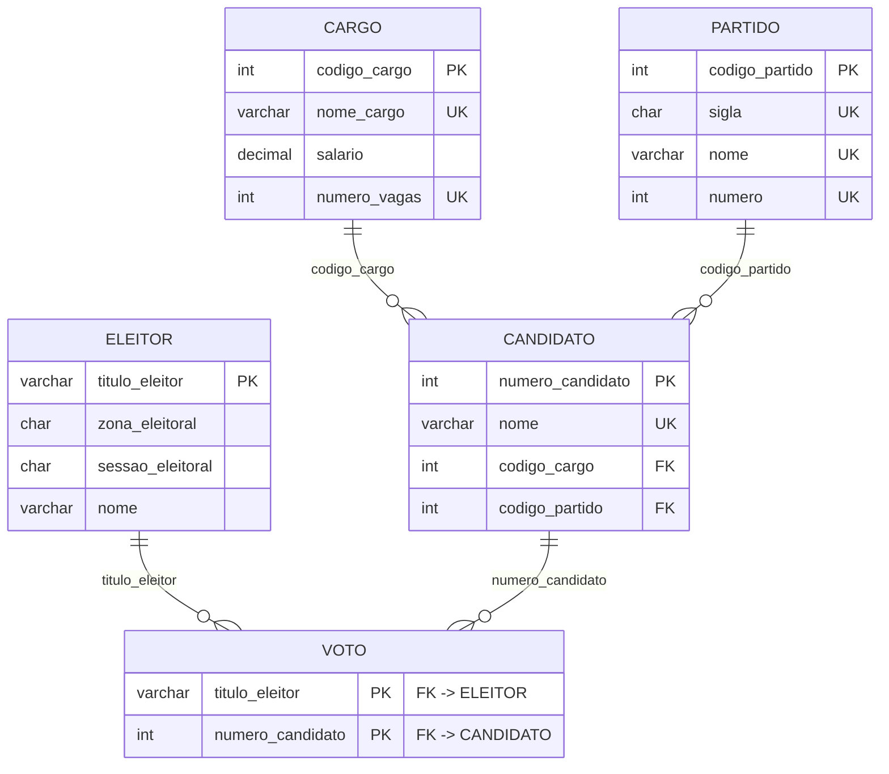

# DER — Diagrama Entidade-Relacionamento

## Chaves primárias
- `cargo.codigo_cargo`
- `partido.codigo_partido`
- `candidato.numero_candidato`
- `eleitor.titulo_eleitor`
- `voto.(titulo_eleitor, numero_candidato)` — **chave composta**

## Chaves estrangeiras
- `candidato.codigo_cargo` → `cargo.codigo_cargo`
- `candidato.codigo_partido` → `partido.codigo_partido`
- `voto.titulo_eleitor` → `eleitor.titulo_eleitor`
- `voto.numero_candidato` → `candidato.numero_candidato`

## Constraints relevantes
- `cargo.nome_cargo`, `cargo.numero_vagas` — UNIQUE
- `partido.sigla`, `partido.nome`, `partido.numero` — UNIQUE
- `candidato.nome` — UNIQUE
- FKs com `ON UPDATE CASCADE ON DELETE RESTRICT`
- PK composta em `voto` impede voto duplicado do mesmo eleitor no mesmo candidato
