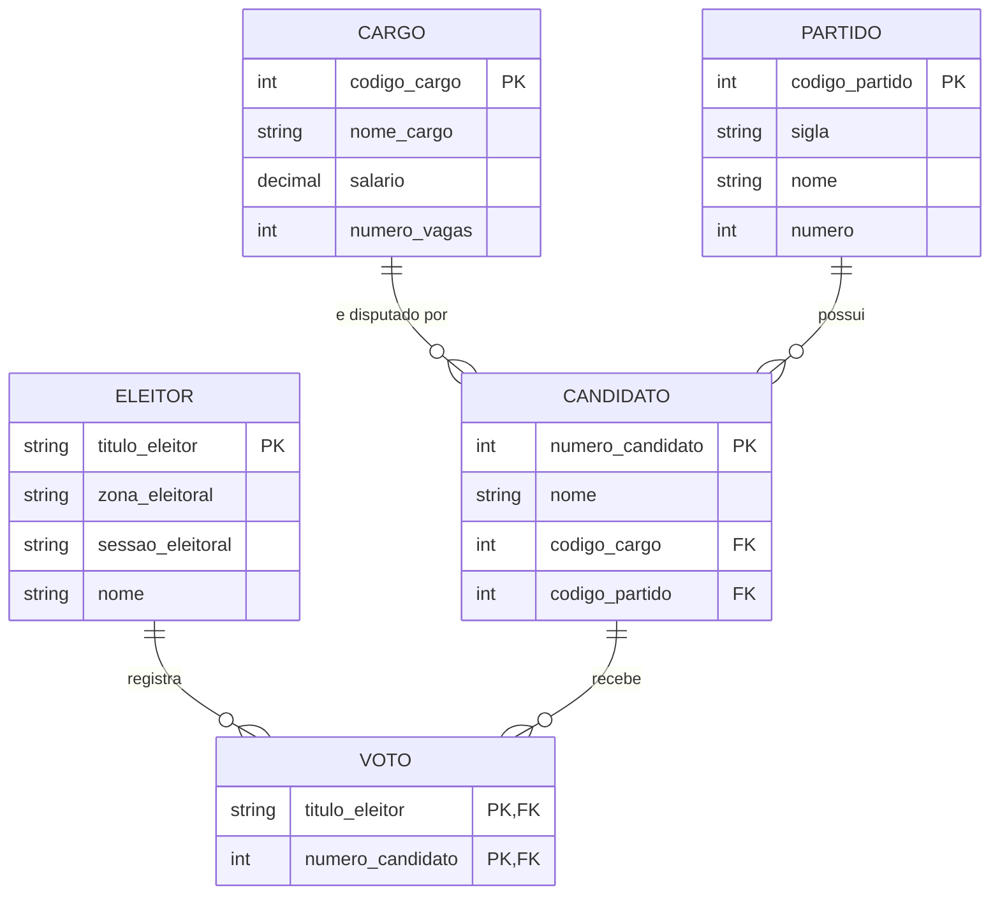

# MER — Modelo Entidade-Relacionamento

## Entidades
- CARGO, PARTIDO, CANDIDATO, ELEITOR, VOTO (associativa)

## Relacionamentos
- CARGO → CANDIDATO (1:N)
- PARTIDO → CANDIDATO (1:N)
- ELEITOR → VOTO (1:N)
- CANDIDATO → VOTO (1:N)

## Cardinalidades
- CARGO (1) : (N) CANDIDATO
- PARTIDO (1) : (N) CANDIDATO
- ELEITOR (1) : (N) VOTO
- CANDIDATO (1) : (N) VOTO
- (ELEITOR N : N CANDIDATO, resolvida pela entidade associativa VOTO)
