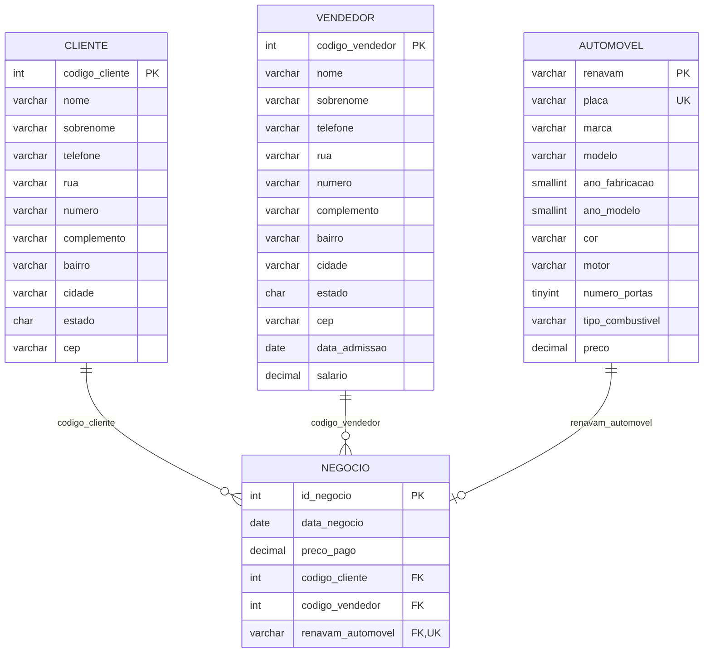

# DER — Diagrama Entidade-Relacionamento

## Chaves primárias
- `automovel.renavam`
- `cliente.codigo_cliente` (substituta)
- `vendedor.codigo_vendedor` (substituta)
- `negocio.id_negocio` (substituta)

## Chaves estrangeiras
- `negocio.codigo_cliente` → `cliente.codigo_cliente`
- `negocio.codigo_vendedor` → `vendedor.codigo_vendedor`
- `negocio.renavam_automovel` → `automovel.renavam`

## Constraints relevantes
- `automovel.placa` — UNIQUE
- `automovel.preco` — CHECK (> 0)
- `negocio.renavam_automovel` — UNIQUE (cada automóvel vendido uma única vez)
- `negocio.preco_pago` — CHECK (> 0)
- FKs com `ON UPDATE CASCADE ON DELETE RESTRICT`
