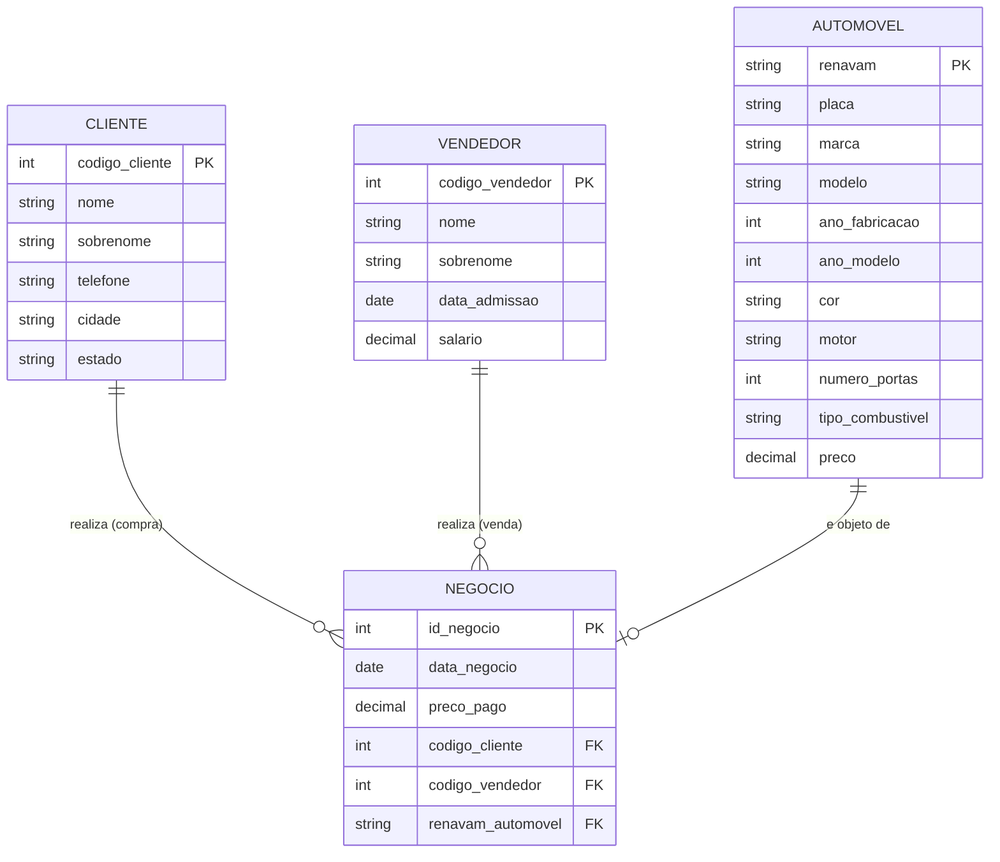

# MER — Modelo Entidade-Relacionamento

## Entidades
- AUTOMOVEL, CLIENTE, VENDEDOR, NEGOCIO (associativa)

## Relacionamentos
- CLIENTE → NEGOCIO (1:N)
- VENDEDOR → NEGOCIO (1:N)
- AUTOMOVEL → NEGOCIO (1:1, cada automóvel vendido no máximo uma vez)

## Cardinalidades
- CLIENTE (1) : (N) NEGOCIO
- VENDEDOR (1) : (N) NEGOCIO
- AUTOMOVEL (1) : (0..1) NEGOCIO
